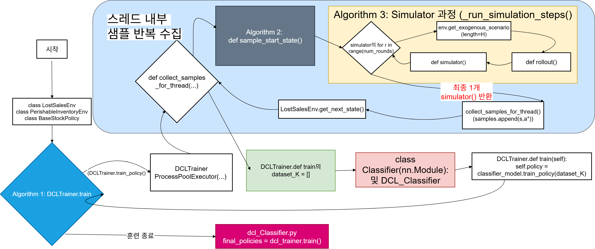
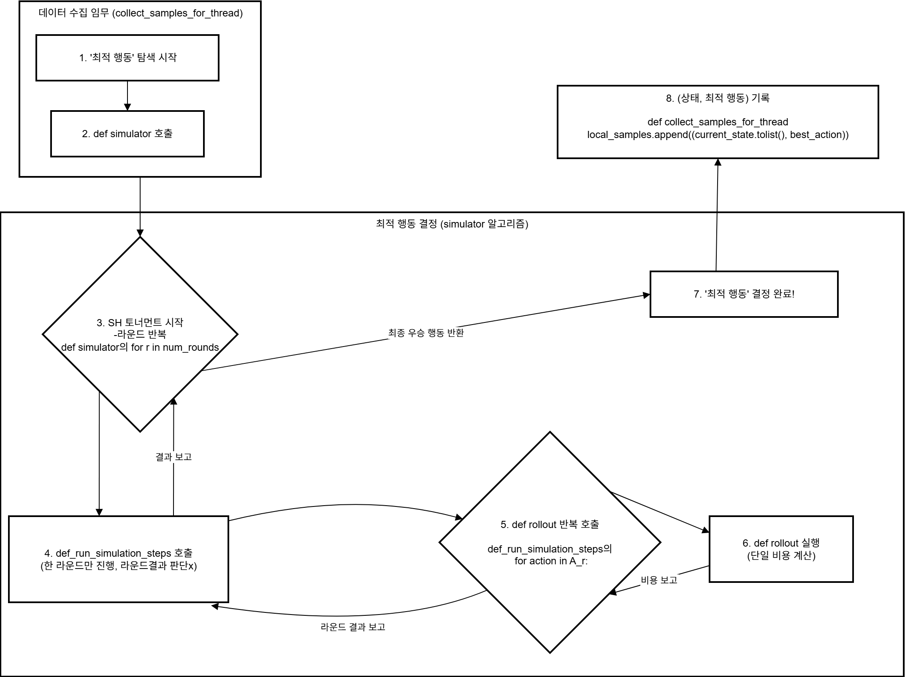

# 📦 Deep Controlled Learning (DCL) for Inventory Control

> **확률적 리드타임·부패성(Perishable) 재고 시스템 최적화 — 시뮬레이션 기반 Deep Controlled Learning**

-blue)


## 💡 프로젝트 개요 (Overview)

본 프로젝트는 **확률적 리드타임(Stochastic Lead Time)과 부패성 재고(Perishable Inventory)** 환경에서 범용 강화학습(Policy Gradient)이 겪는 **수렴 불안정·낮은 샘플 효율** 문제를 극복하기 위한 솔루션입니다.

일반적인 RL 대신 **시뮬레이션 + 분류기(Classifier)** 조합인 **Deep Controlled Learning (DCL)** 패러다임을 채택하여, 극도로 복잡한 재고 운영 문제의 최적 정책을 효율적으로 학습합니다.

> 산업경영 인공지능 모델링 (성결대 2025-2) 팀 프로젝트 / **역할: 팀장 (전체 알고리즘 설계 주도)**
> 참고 논문: *Deep Controlled Learning for Inventory Control* (Lecture Note 1) — https://arxiv.org/abs/2011.15122

## 🎯 핵심 문제 (Problem)

| 항목 | 내용 |
|------|------|
| 환경 | 확률적 리드타임 + 부패성 재고 (Lost Sales / Perishable) |
| 한계 | 범용 RL은 고분산 환경에서 Policy Gradient 수렴 불안정, 탐색 공간 과대 |
| 접근 | 시뮬레이션으로 최적 행동을 추정하는 **Controlled Best Policy Iteration (CBPI)** |

## 🧠 방법론 — DCL 알고리즘 (Methodology)



핵심 기술 3가지:

1. **Sequential Halving (SH)** — 매 라운드 하위 50% 후보 행동 제거로 최적 후보를 효율적으로 좁힘 → **시뮬레이션 소요량 100배 감소**
2. **CRN (Common Random Numbers)** — 동일 랜덤 시나리오를 후보 정책에 공유하여 분산 최소화 → 공정한 정책 비교
3. **CBPI (Controlled Best Policy Iteration)** — 시뮬레이션으로 현재 상태의 최적 행동 추정, Classifier가 (상태 → 행동) 정책 학습

### 알고리즘 구조



```
DCLTrainer.train (Algorithm 1)
    └── n번 반복
        ├── SampleStartState (Algorithm 2)   ← L길이 워밍업 샘플 수집
        ├── Simulator (Algorithm 3)           ← SH 라운드 반복 + CRN
        │   ├── CRN으로 시나리오 생성
        │   ├── 평균비용 상위 절반 생존
        │   └── 최종 1개 (s, a*) 기록
        └── Classifier 정책 학습 (Algorithm 4) ← π 업데이트
```

## 📊 결과 (Results)

| 지표 | 결과 |
|------|------|
| 최적해 오차 | **≤ 0.2%** (전 테스트케이스) |
| 시뮬레이션 효율 | 기존 대비 **100배 감소** |

## 📁 레포지토리 구조 (Repository Structure)

* `src/dcl_definitions.py`: Classifier 일부 + 핵심 알고리즘(SH/CRN/CBPI) 및 시뮬레이션 환경 구현 — **가장 핵심이 되는 코드**
* `notebooks/dcl_Classifier.ipynb`: `dcl_definitions`를 라이브러리로 불러와 학습을 수행 (Lost Sales / Perishable 문제를 셀별 구현). 주피터 노트북은 병렬연산 제약이 있어 정의/학습 코드를 분리함
* `notebooks/dcl_with_pth.ipynb`: 학습된 정책(`.pth`)을 불러와 state 입력 → action을 도출하는 추론 코드
* `checkpoints/`: 학습된 정책 가중치 (`.pth`)
* `docs/PPT_DCL_for_Inventory_Control.pdf`: 발표 자료
* `docs/images/`: 알고리즘·시뮬레이터 다이어그램

> 비고: 데이터셋 규모가 작아 동봉된 정책(`.pth`)의 합리성은 제한적이며, 알고리즘 구조 검증이 주 목적입니다.

## 🚀 시작하기 (How to Run)

```bash
# 1. 의존성 설치
pip install torch numpy scipy pandas matplotlib

# 2. 학습 (Jupyter)
#    notebooks/dcl_Classifier.ipynb 실행 (Lost Sales / Perishable 셀 선택)

# 3. 학습된 정책으로 추론
#    notebooks/dcl_with_pth.ipynb 실행
```

## 🔗 관련 자료

* 핵심 알고리즘 개념: CBPI / Sequential Halving / CRN
* End-to-End SCM AI 파이프라인의 **Phase 3 (Inventory / 재고운영)** 단계
